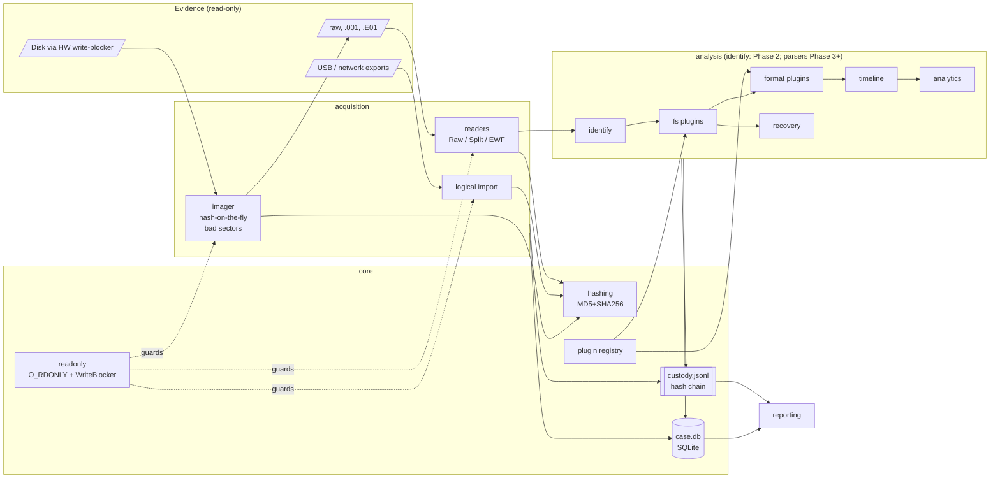
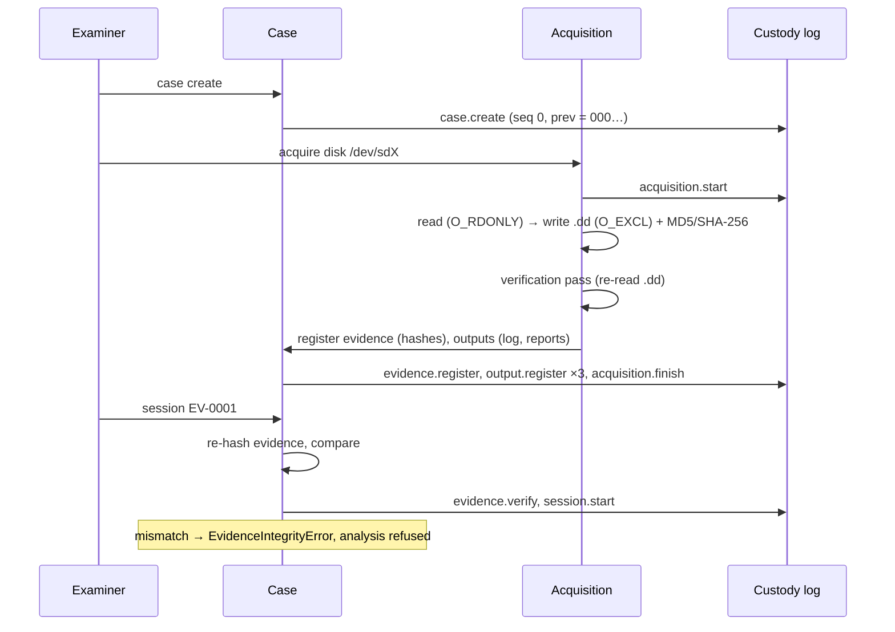

# ForensiDVR Architecture

Status: Phase 0-2. Sections for later phases are marked *planned*.

## Principles

1. **Evidence is read-only.** Every reader opens with `O_RDONLY` through `core.readonly`; the
   optional `WriteBlocker` intercepts write attempts on protected paths inside the process.
2. **Everything is hashed.** MD5 + SHA-256 in one pass (`core.hashing`). Sources are hashed at
   acquisition and re-verified by `Case.start_session()` before any analysis.
3. **Everything is logged.** `core.custody` is an append-only JSONL log where every record carries
   the SHA-256 of its predecessor; the head is anchored in the case DB.
4. **Raw values are never discarded.** `TimestampValue` keeps the raw value next to the UTC value.
5. **Deterministic.** Canonical JSON (sorted keys), sorted iteration, no wall-clock values in
   evidence-derived outputs.
6. **Never crash on bad data.** Plugins emit `PluginWarning`s and continue with partial results.

## Package layout

```
forensidvr/
  core/         errors, io (ByteSource), readonly, hashing, custody, models, plugins, config, case
  acquisition/  readers (raw/split/E01), ewf, imager, logical, workflow
  identify/     device fingerprinting (docs/identification.md) (Phase 2)
  fs/           FSPlugin interface + vendor-family plugins   (generic fallback now; vendors Phase 3-4)
  formats/      FormatPlugin interface + container parsers   (Phase 3-4)
  recovery/     stale-index recovery, carving                (Phase 5)
  timeline/     normalisation, correlation                   (Phase 6)
  analytics/    motion/object/face                           (Phase 7)
  reporting/    HTML/PDF/JSON                                (Phase 8)
  api/          FastAPI                                      (Phase 8)
  cli/          Typer CLI
ui/             React + TypeScript                           (Phase 8)
```

Modules are sub-packages of a single `forensidvr` package (instead of top-level `/core`, `/fs`
…) because top-level names such as `core` and `fs` collide with existing PyPI packages.

## Component diagram



## Evidence lifecycle



## Plugin model

* `FSPlugin` (`forensidvr/fs/base.py`): `probe(image) → ProbeResult`, `mount(image) → MountInfo`,
  `list_recordings()`, `read_index()`, `iter_unallocated()`, `read_extent()`.
* `FormatPlugin` (`forensidvr/formats/base.py`): `probe(stream)`, `parse_frames()`,
  `extract_metadata()`, `to_standard_video(out, remux_only=True)`.
* All results derive from `Finding` (`sources`, `raw_metadata`, `confidence`, `warnings`,
  `plugin`, `plugin_version`).
* Discovery (`core.plugins.discover`) scans `forensidvr.fs` / `forensidvr.formats` and the
  `forensidvr.fs` / `forensidvr.formats` entry-point groups. Import failures are recorded in the
  `DiscoveryReport` and skipped. The `generic-carve` plugin (confidence 0.01) guarantees an
  "unknown – attempt generic carving" path.
* Vendor rebrands (CP Plus, Honeywell, Godrej …) will be mapped to family plugins by the
  identification engine (Phase 2) rather than duplicated.

## Case directory

```
<case>/case.db  custody.jsonl  evidence/  exports/  reports/  logs/
```

Tables: `meta`, `evidence`, `acquisitions`, `outputs`, `sessions`, `custody_anchor`.

## Custody record

```json
{"schema":1,"seq":3,"timestamp_utc":"2026-01-01T00:00:03.000000Z","case_id":"…",
 "actor":"insp.rao","action":"evidence.register","details":{…},"host":"…","os_user":"…",
 "tool":"ForensiDVR 0.1.0 (Python 3.11.16)","prev_hash":"<sha256 of seq 2>","entry_hash":"<sha256>"}
```

`entry_hash = SHA-256(canonical_json(record without entry_hash))`.
